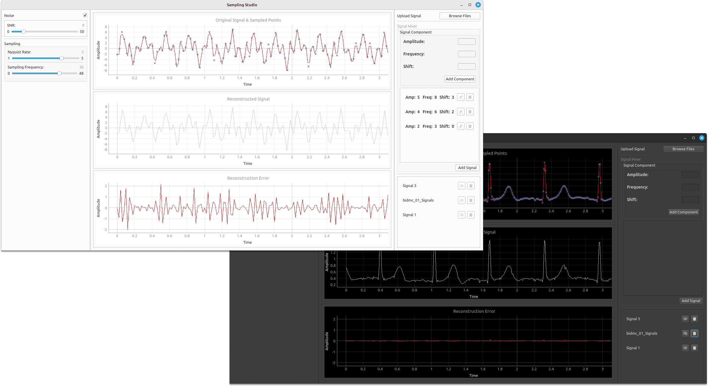

# Sampling Studio

Sampling Studio is a desktop application built with PyQt that enables users to work with biomedical signals. With Sampling Studio, you can open biomedical signal files, visualize them, sample them at a chosen frequency, and even add noise to the signals. Additionally, you can create your own signals using the built-in signal composer by specifying different signal components like amplitude, frequency, and shift.

<div align="center">
  
</div>

## Table of Contents

- [Features](#features)
- [Getting Started](#getting-started)
- [Usage](#usage)
- [Contributors](#contributors)

## Features

- **Open Biomedical Signals:** Load biomedical signal files for visualization and processing.

- **Signal Sampling:** Adjust the sampling frequency using intuitive sliders to meet your requirements.

- **Signal Composer:** Create custom signals by combining individual components, specifying their amplitude, frequency, and phase.

- **Add Noise:** Introduce controlled noise to your signal for various testing and analysis purposes.

## Getting Started

### Prerequisites

- Python 3.6 or higher
- PyQt6

### Installation

1. Clone this repository to your local machine.

```bash
git clone https://github.com/bodykudo/sampling-studio.git
```

2. Install the required dependencies.

```bash
pip install requirements.txt
```

3. Run the application.

```bash
python main.py
```

## Usage

1. **Open Biomedical Signals:**

   - Click the "Open Signal" button to select a biomedical signal file for visualization.

2. **Signal Sampling:**

   - Use the sampling frequency sliders to adjust the sampling frequency to your desired value.

3. **Signal Composer:**

   - Click the "Signal Composer" tab.
   - Enter the desired signal components, including amplitude, frequency, and phase.
   - Click "Compose" to generate your custom signal.

4. **Add Noise:**

   - Select the "Add Noise" option and specify the noise level.

## Contributors

We would like to acknowledge the following individuals for their contributions to the research:

<table>
  <tr>
    <td align="center">
    <a href="https://github.com/Bodykudo" target="_black">
    
    <br />
    <sub><b>Abdallah Magdy</b></sub></a>
    <td align="center">
    <a href="https://github.com/abduelrahmanemad" target="_black">
    
    <br />
    <sub><b>Abdelrahman Emad</b></sub></a>
    </td>
    </td>
    <td align="center">
    <a href="https://github.com/MohamedAlaaAli" target="_black">
    
    <br />
    <sub><b>Mohamed Alaa</b></sub></a>
    </td>
    <td align="center">
   <td align="">
    <a href="https://github.com/Medo072" target="_black">
    
    <br />
    <sub><b>Mohamed Ibrahim</b></sub></a>
    </td>
    </tr>
 </table>

---

Enjoy working with biomedical signals in Sampling Studio!
